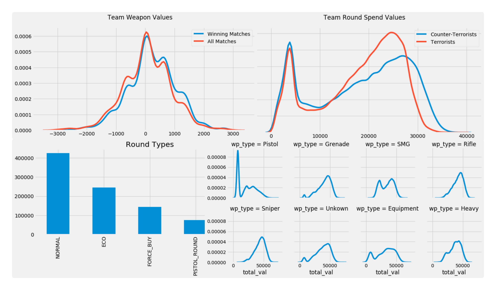

# CS:GO Competitive Strategy Playbook

## Executive Summary
Counter-Strike: Global Offensive (CS:GO) is a tactical, round-based objective shooter that serves as a high-stakes **resource management simulation**. As one of my favorite games, I chose to analyze its data because it represents a perfect intersection of high-velocity telemetry and complex economic decision-making.

This playbook identifies two critical levers of competitive success: **Spatial Dominance** and **Spend Efficiency**.

---

## 1. Geospatial Analysis: Tactical Intelligence
**Project Title: [Strategic Performance Analytics: CS:GO Tactical Intelligence]**

Utilizing event-level telemetry, I mapped the "Winning Geometry" of the map **de_mirage**. By transforming raw engine coordinates into normalized 2D spatial data, I identified the mathematical probability of round success based on player positioning.

* **Defensive Anchors:** Identified that Counter-Terrorist success is highest when occupying "Power Positions" (Window, Connector) that contest mid-map control early.
* **Post-Plant Geometry:** Quantified how the Terrorist defensive perimeter expands toward access corridors (Palace, Market) once the objective is active to create wide crossfires.
* **Asset Optimization:** Analyzed the "Effective Combat Radius" of the AWP sniper rifle, proving its maximum ROI is found in long-range corridors like Mid-Window rather than close-quarter sites like Bombsite B.

**Key Finding:** Success is driven by **"Active Anchoring"**—controlling entry bottlenecks rather than playing passive, reactive defense from the back of a site.

---

## 2. Gunplay Economics: Resource ROI
**Project Title: [Strategic Resource Allocation: Gunplay Economics]**

This section treats the game as a financial model to evaluate the "Cost of Victory." By analyzing over 400k weapon events, I evaluated the correlation between capital expenditure and win probability.

* **The Efficiency Frontier:** Identified the **$10,000-per-player "Sweet Spot"** where teams achieve maximum lethality; spending beyond this point yields diminishing returns.
* **Marginal Utility of Wealth:** Proved that outspending an opponent only provides a **~10% increase** in win probability, highlighting that tactical skill often mitigates financial deficits.
* **Economic Bipolarity:** Discovered a distinct **Bimodal Distribution** in spending, where successful teams avoid "Mid-Tier" investments, preferring to either "Full Save" or "Full Buy" to maximize efficiency.

**Key Finding:** Winning is not about having the most money; it is about **"Spend Optimization"**—minimizing time in the inefficient mid-tier budget zones and maximizing high-ROI full-buy rounds.

---

## Tech Stack & Methodology
* **Language:** Python (Pandas, NumPy)
* **Visualization:** Seaborn, Matplotlib (Spatial Heatmaps, KDE Plots, FacetGrids)
* **Data Source:** [CS:GO Matchmaking Damage Dataset](https://www.kaggle.com/datasets/skihikingkevin/csgo-matchmaking-damage)
* **Framework:** Minto Pyramid Principle (Situation-Complication-Question-Answer)
